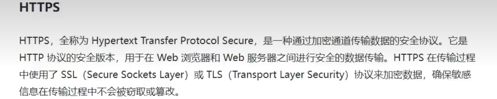
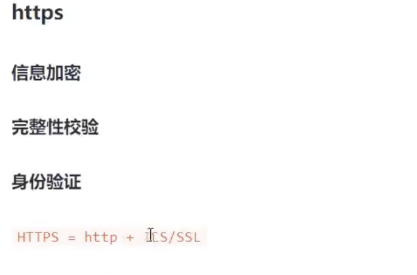
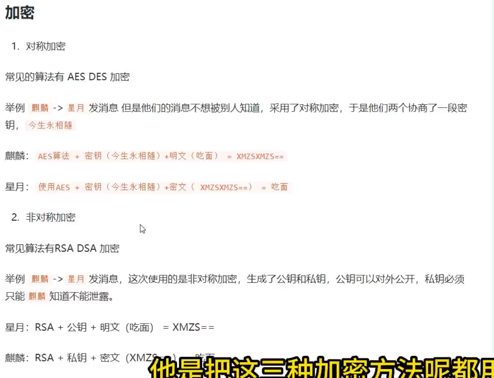
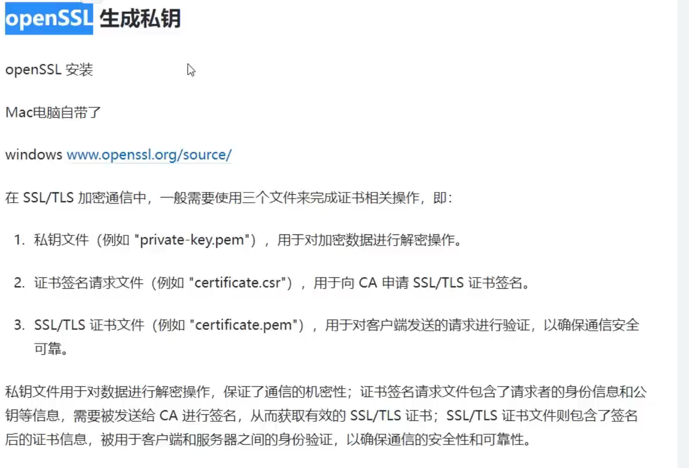
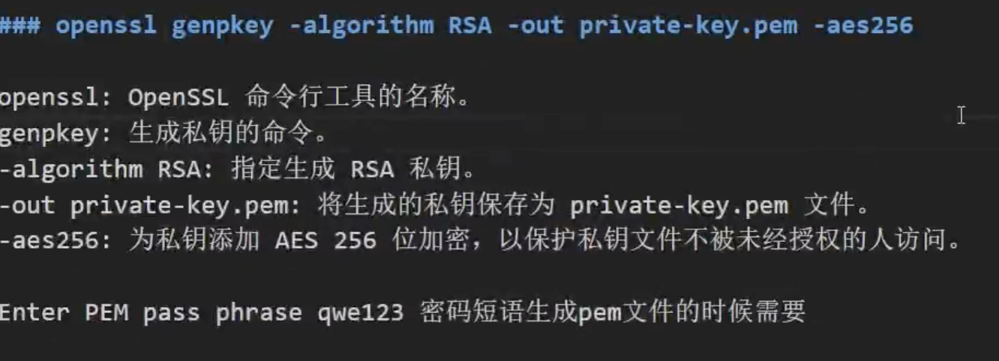

# https ssl tsl

 
 

  

  

## 开发和测试环境使用

openssl genpkey -algorithm RSA -out private-key.pem -aes256
输入一段密码 生成私钥 111111

生成pem证书文件  csr证书签名文件
openssl req -new -key private-key.pem -out certificate.csr  

密码盐 ZXZXZX

生成数字证书
openssl x509 -req -in certificate.csr -signkey private-key.pem -out certificate.pem

### nodejs server https
### nginx https
生成没有密码的key
openssl genrsa -out nginx.key 2048
openssl req -new -key nginx.key -out nginx.csr
openssl x509 -req -in nginx.csr -signkey nginx.key -out nginx.crt
