> markdown 文件换行  
在行尾添加两个空格，然后按 Enter 键。这将在文本中创建一个换行符。  
每段文本之间添加一个空行。这将在文本中创建一个新的段落。
# 网络课程
## 七层模型的故事
深夜中，在一家美国酒吧坐着几个正在谈论迪斯尼电影里的7个小矮人，他们把小矮人的名字写在餐中纸上，有人开玩笑说7对于网络分层是个好数字，这几个人就是制定OSI标准小组的成员，后来OSI真的就设计成了七层模型，不过给七层模型重新起了听上去更科学的名字，就这样诞生了。

### OSI 七层参考模型 和TCP/IP
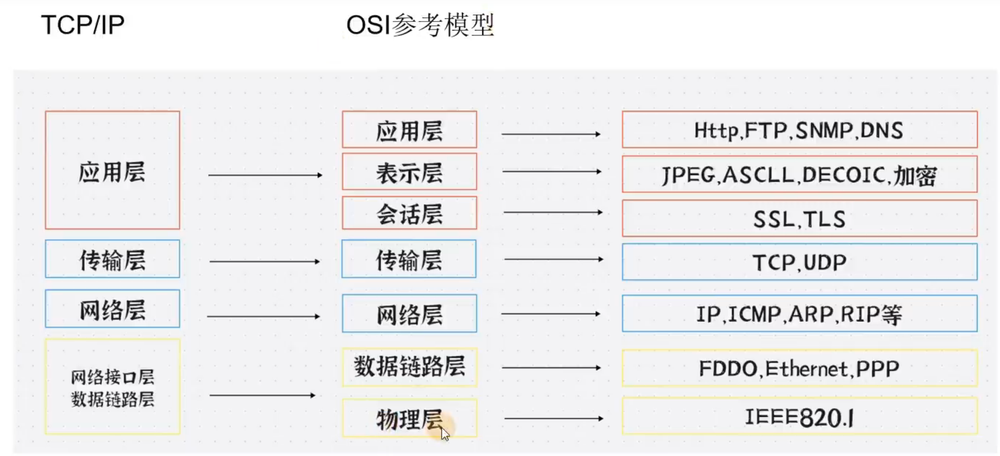

 > 七层参考模型是理论，tcp、ip 是实施。

#### 物理层
物理层是直接和物理介质打交道的。
物理层的设备 网卡，网线，集线器，中继器，调制解调器
物理层信道
    - 有线信道 电线杆
    - 无线信道

> 在这一层通过(电，光，无线电波)，会获取他们对应的传送信号，电压，转换成010101010101但是数据还未组织，它们的单位为bit，所以在这一层主要就是传输比特流

物理层传输的就是比特流

#### 数据链路层
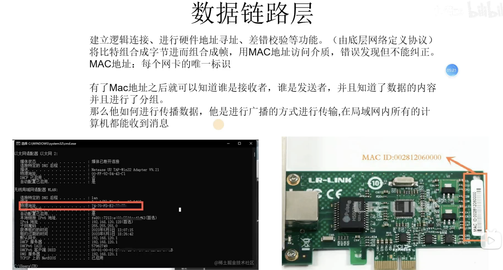

010101 => 数据帧  媒介是mac地址,每个网卡上有一个唯一标识。

组装数据帧

#### 网络层
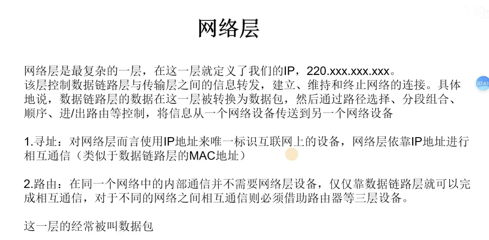

ip地址作为寻址的媒介,路由器的路由 

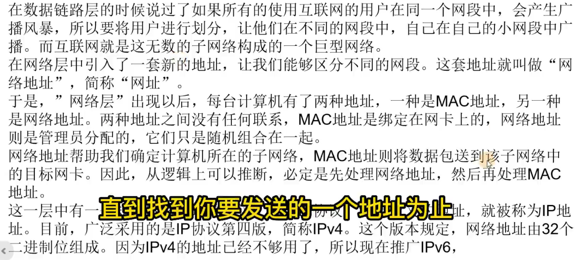

ip协议 ipv4  ipv6

#### 传输层
传输层主要就是定义我们的端口号，以及控流，和校验。

并且拥有两个熟知的协议 TCP UDP

TCP 是面向连接的协议并且TCP是可靠的

因为TCP会进行三次握手四次挥手所以是可靠的，但是这样会降低速度

UDP 具有较好的实时性 效率比TCP高

UDP是没有三次握手四次挥手的，故此不稳定，但是速度快常用于直播，游戏

这一层经常被叫数据段

#### 会话层
会话层，是在发送方和接收方之间进行通信时创建、维持、之后终止或断开连接的地方，与电话通话有点相似。

会话层定义了一种机制，允许发送方和接收方启动或停止请求会话，以及当双方发生拥塞时仍然能保持对话。

会话层包含了一种称为检查点(Checkpoint)的机制来维持可靠会话。检查点定义了一个最接近成功通信的点，并且定义了当发生内容丢失或损坏时需要回滚以便恢复丢失或损坏数据的点，即断点下载的原理!

这一层经常被叫报文

#### 表示层
表示层主要做了几件重要的事情 安全，压缩，也是程序在网络中的一个翻译官。

1.安全 在你的数据发送之前进行加密，在接受者的表示层进行解密。
2.表示层还会对图片文件等格式进行解码和编码 例如 JPEGASCII 图片是人类能读懂的计算机需要转换成计算机能读懂的编码。

这一层经常被叫报文

#### 应用层
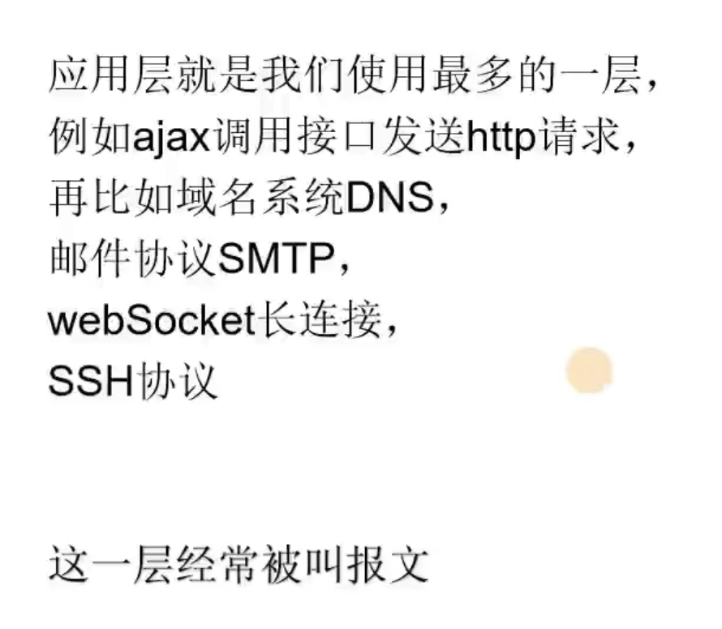
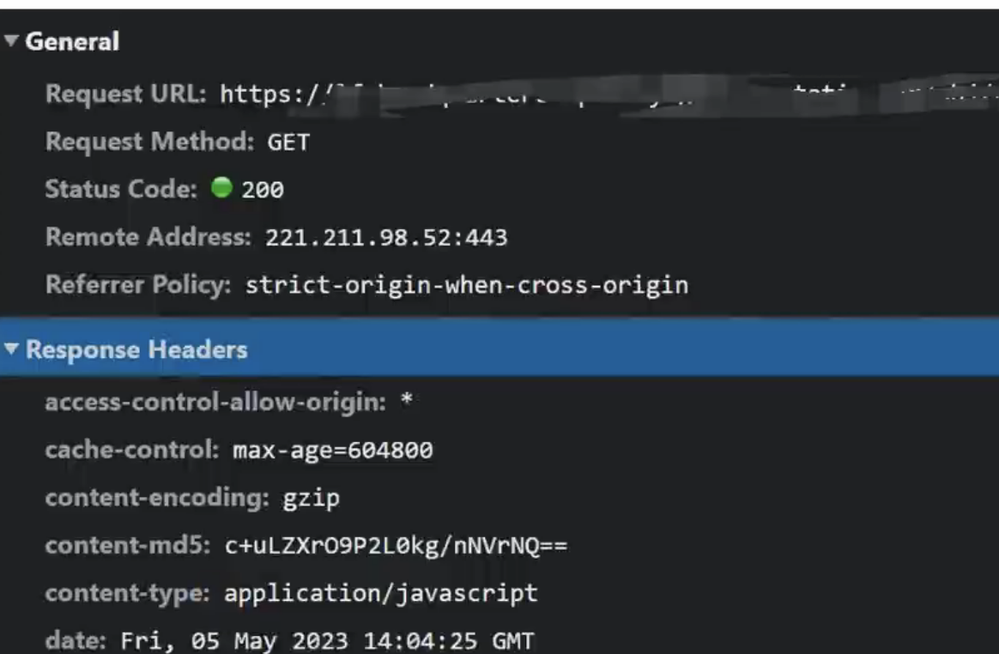

## TCP 三次握手
在上一节讲过TCP是面向连接的  
什么是面向连接，面向连接就是数据通讯的时候需要进行三次握手，断开通信的时候进行 四次挥手

1.seq(sequence number)，序列号随机生成的  
2.ack(acknowledgement number)确认号ack=seg+1  
3.ACK (acknowledgement)确定序列号有效  
4.SYN(synchronous)发起新连接
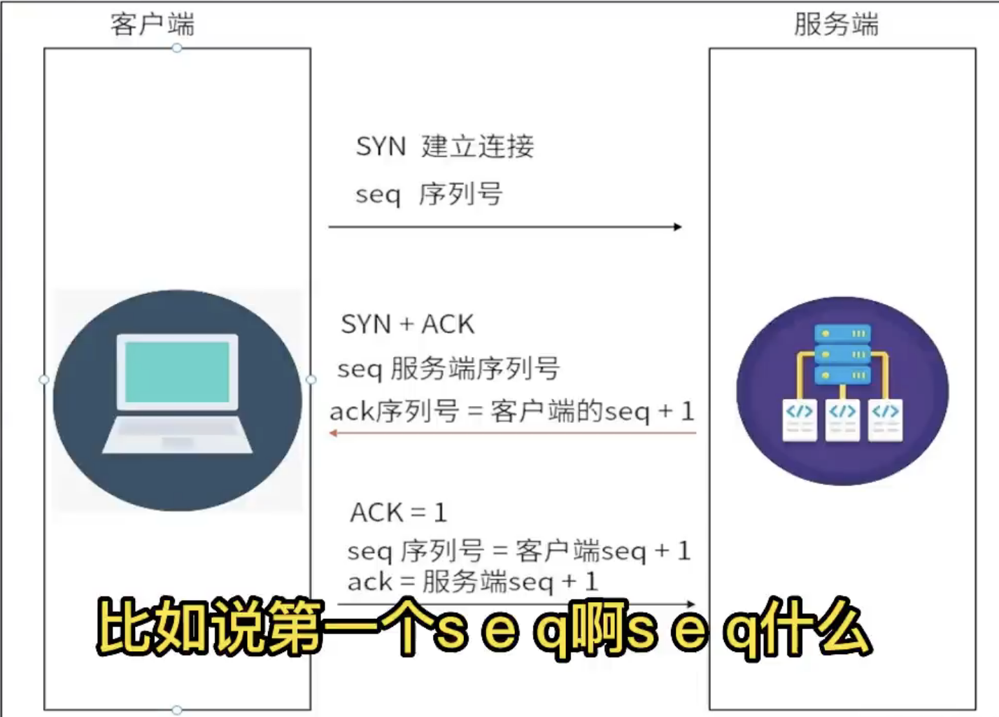

## TCP四次挥手
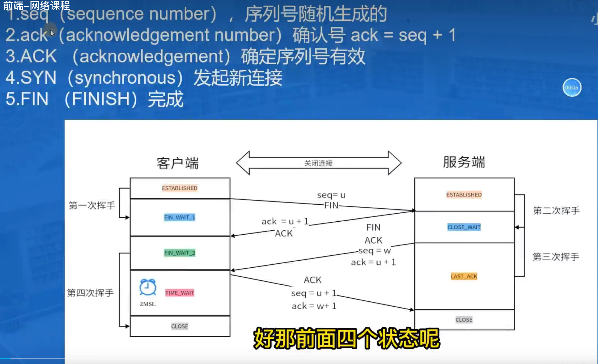

wait2 阶段如果有未完成的请求或者是别的响应,在这个阶段也会处理完成的.  
超时等待状态 2msl 1-4分钟的超时等待时间  

## 工具清晰看握手
WireShark  
中文
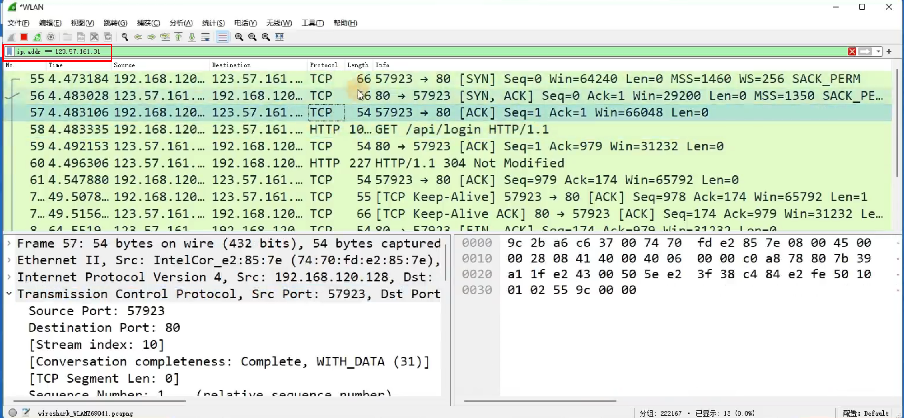

## 浏览器输入url之后……

1. 输入域名
    访问协议  
    域名  
    目录名  
    文件名  
    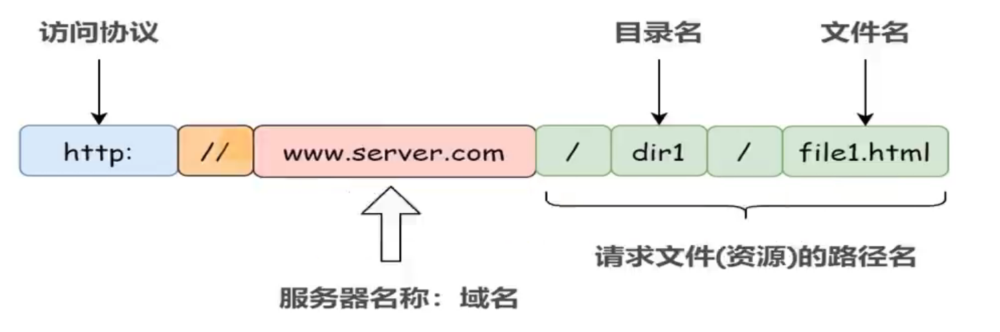

2. DNS查询
    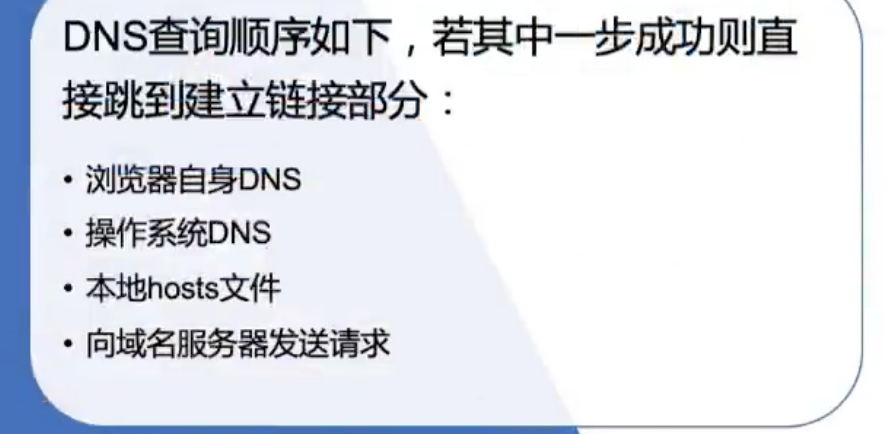
    服务器有ip
    DNS 把ip和域名做映射
    查找顺序
        - 浏览器里的DNS
        - 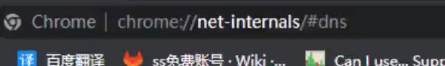

