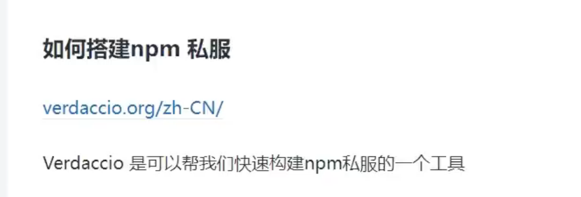

# 发布npm包

创建账号
官网 、 npm adduser  

npm login  
npm publish  

package.json  
files 指定要发布到npm的文件  

## npm 私服
  

faker库事件  

npm install verdaccio -g  
verdaccio --help  

npm adduser --registry http://localhost:5000/
npm publish --registry http://localhost:5000/