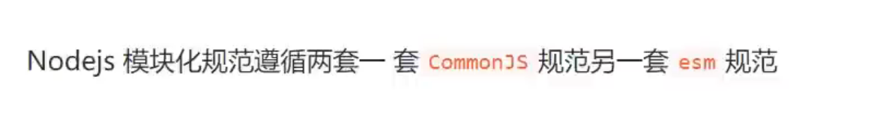
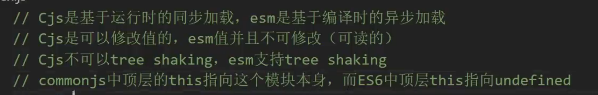

# 模块化



## package.json
```json
"type": "commonjs"
```
每个js文件都是一个模块  
引入自己编写的模块  
require('./test.js')  

引入第三方的模块  
npm i md5  
const md5 = require('md5');  

nodejs 内置模块  
fs http net os child_process  
const fs = require('node:fs');  
高版本需要加node:  
console.log(fs);

C++ 扩展  
addon napi node-gyp .node  

引入json文件  
const data = require('./data.json');  
console.log(data,1);  

模块导出  
module.export = {
    
}

### cjs 和 esm的区别


### nodejs 源代码下载