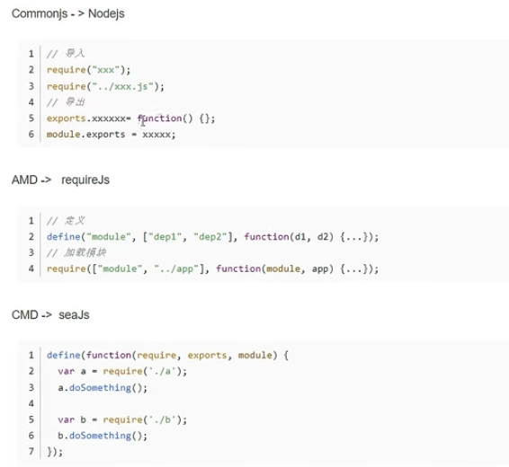

## 学习笔记
### importmap study
### 函数的二义性
箭头函数和普通函数的区别，消除函数的二义性。

### 函数的协变 逆变 双向协变

### 性能优化
#### dll

```
npm i vue pinia vue-router
npm i webpack webpack-cli -D
```

### typescript
#### class

```
tsc --init
ts-node index.ts
Vue extends Dom  继承Dom类
Vue implements VueCls 约束Vue类
readonly 属性不能被修改
private 内部类可使用
protected 给子类和内部类使用

super() // 父类的prototype.constructor.call

// 静态方法 this 执行的是类本身 static修饰的方法和属性
```

#### 枚举
- 数字枚举 - 从0开始递增
```
enum Color {
    Red,
    Green,
    Blue
}

console.log(Color.Red); // 0
console.log(Color.Green); // 1
console.log(Color.Blue); // 2
```
- 增长枚举
- 自定义枚举


#### 类型推断和类型声明
```
// any unknow 顶级类型
// Object
// Number String Boolean
// number string boolean 
// 1 'test' true
// never
```

#### 泛型
TypeScript has two modes.

A project-builder mode (when tsc is invoked with no arguments)
A compile-mode (when tsc is invoked with any arguments) which does not read from the configuration file tsconfig.json
If that sounds confusing, it's even more confusing when you account for

the flag for the compiler-mode to accept a configuration file is called --project
inside the project-builder's configuration file there the pragma is called "compilerOptions"
the compiler-mode and the project-builder mode accept the same configuration file
Anyway, the problem here was that TypeScript was simply ignoring the configuration file in the current working directory that I was running it in.


#### TS配置文件
```json
{
    "compilerOptions":{
        "diagnostics": true, // 编译的时候打印诊断信息,查看编译性能 
        "target": "es2016",// 编译 目标语言的版本
        "module": "commonjs", // 生成代码的模板标准
        "lib":[
            "DOM",
            "ES2015"
        ],// TS 需要引用的库文件 
        "allowJs": true,// 允许编译器编译JS,JSX文件
        "checkJs": true, // 允许在js文件中报错，通过与allowjs一起使用  
        // 不建议 js ts 混合使用
        "rootDir": "./", // 指定输出文件目录（用于输出），用于控制输出目录结构   
        "outDir": "./",  // 指定输入目录

        "declaration": true,// 生成声明文件，开启后会自动生成声明文件
        "declarationDir": "./",  // 指定声明文件的存放目录
        "emitDeclarationOnly": true, // 只生成声明文件 和不生成js
        "sourceMap": true,  // 生成目标文件的sourceMap文件
        "inlineSourceMap":true,// 内联sourceMap  在js文件中会内连sourceMap的相关信息
        "declarationMap": true,   // 为声明文件 生成  sourceMap
        "typeRoots": [],  // 声明文件目录，默认 ./node_modules/@types
        "types": [], // 加载的声明文件包
        "removeComments": true,  // 删除注释
        "noEmit": true,  // 不输出文件，编译后不会生成任何js文件
        "noEmitOnError": true, // 发生错误时，不生成js文件
        "downlevelIteration": true, // 降级遍历起实现，如果目标源是es3/5，那么遍历器会有降级的实现
        "strict": true,   // 开启所有严格类型的检查
        "alwaysStrict": true,     // 在代码中注入 'use strict'
        "noImplicitAny": true,  // 不允许隐士的any类型
        "strictNullChecks": true, // 不允许把 null 、undifined 赋值给其他类型的变量
        "strictFunctionTypes": true,  // 不允许函数参数双向协变
        "strictPropertyInitialization": true, // 类的实例属性必须初始化
        "strictBindCallApply": true, // 严格的bind/call/apply 检查
        "noImplicitThis": true,    // 不允许this有隐士的any类型
        "noUnusedLocals": true,  // 检查只声明、未使用的局部变量，只提示，不报错。
        "noUnusedParameters": true,  // 检查未使用的函数参数 ，只提示，不报错。
        "noFallthroughCasesInSwitch": true,// 防止switch 语句贯穿，没有break语句后面不会执行
        "moduleResolution": "node10", // 模块解析策略，ts默认用node的解析策略，即相对方式的导入
        "baseUrl": "./",    // 解析非相对模块的基地址，会使用baseurl选项为url的路径，默认是当前目录
        "jsxFactory": "React.createElement",// jsxFactory 的解析器
        "jsx": "preserve", // jsx 的解析器 preserve 保留的原来的jsx文件
        "paths": {
            // 路径映射相对于baseUrl 别名
            // 如果使用jq时不想使用默认版本，需要手动指定版本，可进行如下配置
            "@jquery":[
                "node_modules/jquery/dist/jquery.min.js"
            ],
            "@/*":[
                "./str/*"
            ]
        },  

        // 指定一个匹配列表(输入自动指定该路径下的所有ts的相关文件)
        "include":[
            "src/**/*",
            "index.ts"
        ],
        // 指定一个排除列表 include的反向操作
        "exclude":[
            "demo.ts"
        ],
        // 指定那些文件使用该配置，属于手动一个个指定文件 只能指定文件不能指定文件夹
        "files":[
            "index.ts"
        ]


    }
}
```

#### 代码模板标准
ADM COMMONJS UMD
UMD 包含amd和commonjs
UMD 浏览器script链接可以直接使用
#### nodejs 
nodejs 是基于commonjs 运行的
nodejs 新版本也支持es6的模块化规范 ESM

#### sourceMap

#### 模块化引入


CMD是国产的


#### 声明文件
为第三方库,添加声明声明文件

npm i --save-dev @types/express

或者添加一个包含 `declare module 'express';` 的新声明(.d.ts)文件
```js
```

#### 装饰器
```
npm install reflect-metadata
```


